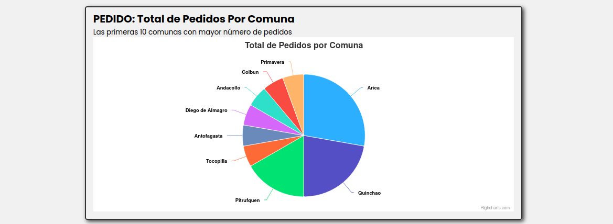
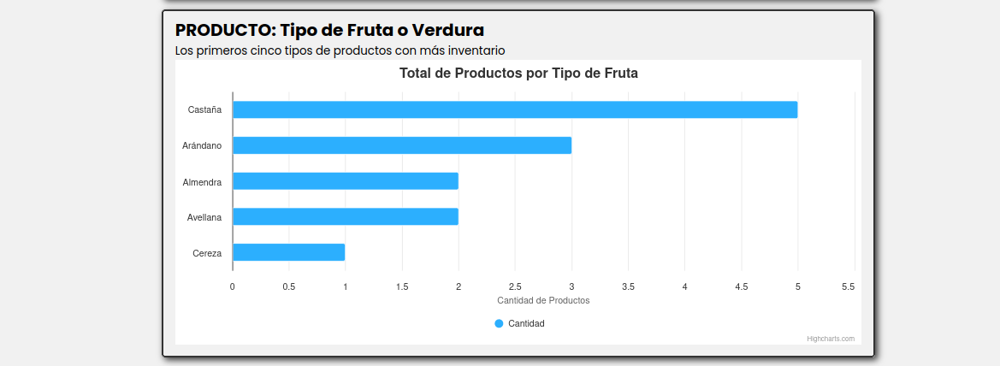

# CC5002 Aplicación Web Scratch

## Resumen

Este proyecto corresponde a la primera entrega de CC5002, se centra en la interacción entre páginas web estáticas para validar la creación de interfaces, la navegación y la validación HTML. Además, implica la implementación de estilos y lógica utilizando CSS y JavaScript.

## Estructura

```bash 
CC5002-Aplicacion-Web
┣ 📂 app
  ┣ 📂 css # estilos para cada archivo html
  ┣ 📂 html  # Almacena los archivos HTML
  ┣ 📂 images # Guarda las imágenes utilizadas en el proyecto
  ┗ 📂 js # Contiene los archivos JavaScript
┣ 📑 comunas-ciudades.json # datos ciudades por región de Chile
┣ 📑 frutas-verduras.json # datos frutas y verduras permitidas
┗ 📑 README.md # consideraciones de desarrollo
```
## Uso

## TAREA1

Para ejecutar el proyecto bajo las mismas condiciones de desarrollo, asegurar de estar en el directorio raíz `CC5002-Aplicacion-Web` y luego inicializa el proyecto con la extensión `Live Server` de `Visual Studio Code`.


## Consideraciones

1. Para el apartado de informacion-producto.html y informacion-pedidos.html se implementar un estructura dinámica que permita mostrar exactamente la información que se selecciona en ver-producto.html y ver-pedido.html respectivamente. Se decide insertar el HTML de información en la página donde se ven los productos por decisión creativa.

2. **Responsive:** Se considera el uso de **contenedores flexibles** y **medidas dinámicas** para que se adapte en diferentes resoluciones estandar  y se realizan pruebas de uso en los navegadores **Vivaldi** y **Firefox**. A pesar de lo anterior, esta versión no está diseñada para ser completamente *responsive* en todos los formatos de pantalla.

3. **Teléfono:** Se considera como valido solo números moviles nacionales. Si bien se limita el campo de entrada a 15 carácteres por enunciado, posteriormente solo se aceptar entradas de 9 carácteres.


## TAREA2

Se debe ejecutar un docker con el motor de mysql y utilizar las credenciales entregadas por el cuerpo docente.

``` bash
docker  run -d -p 3306:3306 --name mysql_server -e MYSQL_ROOT_PASSWORD=0123456789 mysql:latest
```

Ejecutar el rpeositorio como

```bash
python3 app/app.py
```

## TAREA3

### Funcionalidades de Pedidos

1. **Agregar Pedido (2 puntos):**
   - Implementación de un formulario con validaciones en Javascript (clientside) y con Python (serverside). Manejo de mensajes de éxito o errores al volver a la página de inicio.

2. **Ver Pedidos (1 punto):**
   - Implementación de un listado paginado de pedidos obtenidos de la base de datos. Cada página presenta 5 elementos, ordenados por fecha de pedido en orden descendente.

3. **Información de Pedido (1 punto):**
   - Implementación de visualización detallada al hacer clic en un pedido, obteniendo datos dinámicamente desde la base de datos mediante peticiones asíncronas.

### NUEVA FUNCIONALIDAD: Visualización de Estadísticas

1. **Gráfico de Productos y Pedidos (1 punto cada uno):**
Utilización **fetch** para generar gráficos de productos por tipo y pedidos por comuna.

    - **PEDIDOS**: Se añade un gráfico con las primeras 10 comunas que acumulan mayor número de pedidos.
      
    - **PRODUCTOS**: e añade un gráfico con los primeros 5 tipos de frutas o verduras con mayor inventario.
      


## Recursos de Terceros

Todos los iconos utilizados se extraen mediante una licencia gratuita desde la plataforma **Freepik**.

